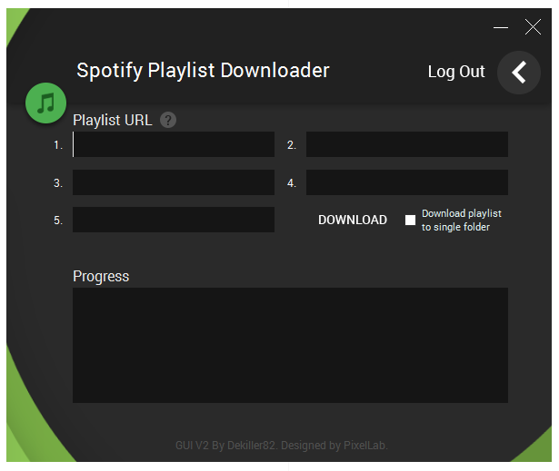

# Spotify Playlist Downloader With Windows GUI

## IMPORTANT NOTICE THE TOOL IS NOT WORKING. DOWNLOADING IT WOULD BE USELESS. WORKING ON A UPDATE.

## 12/MAY Still working.... sorry.

Download an entire spotify playlist (160kbps mp3's) to your local machine with a simple interface

When it starts downloading it checks if you already downloaded the song if so it skips it.
When done downloading it also writes the ID3 data and album art to the file.

###To install:
Install nodejs (USE INSTALLER!! Install 64bit if you're on a 64bit system!!!) if you haven't already. ([NodeJS Downloads](https://nodejs.org/en/download/))  
Microsoft .NET Framework 4.6 if you haven't already. ([Download](https://www.microsoft.com/en-US/download/details.aspx?id=48130))

Then download this repository ([HERE](https://github.com/dekiller82/spotify-playlist-downloader-with-windows-gui/archive/master.zip)) or use the button on github. 

Unpack the repository and run the .exe (source code can be found [here]( https://github.com/dekiller82/Spotify-Playlist-Downloader-GUI))

###First Time Setup (Only needs to be done right after downloading)

**I recommend using a brand new Spotify Account for this tool!**

Log In using your Spotify Username and Password.

You can't login with Facebook accounts so you will have to create a new Spotify user to login.

The tool will check for the node_modules folder on startup. If it's not there it will take care of the npm install.

###How To Get Playlist URL

[CLICK HERE FOR A STEP BY STEP GUIDE WITH PICTURES](http://imgur.com/a/tAFo3)

###Changelog

#####V2.0

**RELAUNCH! IF YOU ALREADY HAVE V1.2 OR BELOW FULLY REINSTALL THIS REPOSITORY**

New UI

Bugfix for Usernames with a dot in their name

New Log in screen

Password will be wiped on log out only

#####V1.2

**IF YOU ALREADY HAVE V1.1.6 OR BELOW PLEASE FULLY REINSTALL THIS REPOSITORY**

Tool now also downloads album art and attaches it.

You can now download up to 5 playlists in 1 go

Instead of opening a new prompt for downloading output is now in the program

#####V1.1.6

Bugfix for underscores in usernames

#####V1.1.5

Added security feature to wipe password after download.

#####V1.1

You can now download up to 3 playlists in 1 go

#####V1.0.6

NodeJS launch bugfix

#####V1.0.5

Added option for /Artist/Album file structure

#####V1.0.1

Updated default download folder to the Windows Music folder.

Updated Layout

#####V1

Initial Release

###TO-DO

Add option to set download folder (For now songs will be saved to: C:\Users\youruser\Music)

~~Add option to download multiple playlists~~ DONE! Since V1.1

~~Add option to download all mp3's to a single folder~~ DONE! Since V1.0.5 with the Artist/Album option

###Additional Comments

If you get any errors please go to "C:\Program Files\nodejs" and see if node.exe and npm.cmd are installed there

To download Albums for now the only way to do it is to add the songs to a playlist and then download that playlist.

Free Accounts get limited after a while though, but starts downloading again afterwards

You can't login with Facebook accounts so you will have to create a new Spotify user to login.

#####Thanks to /u/dva010/

If you are trying to download an artist that has a '.' at the end of their name, it will create a folder that Windows will not allow you to delete without running a command in cmd.

Pasted command below on how to remove the folder if you guys run into this issue.

Command to delete folder that ends in '.'

rd /s "\?\C:\Documents and Settings\User\Desktop\Annoying Folder."

### Disclaimer:

- This was done purely as an academic exercise.
- This my first coding project so code is sloppy en ugly
- I do not recommend you doing this illegally or against Spotify's terms of service.

